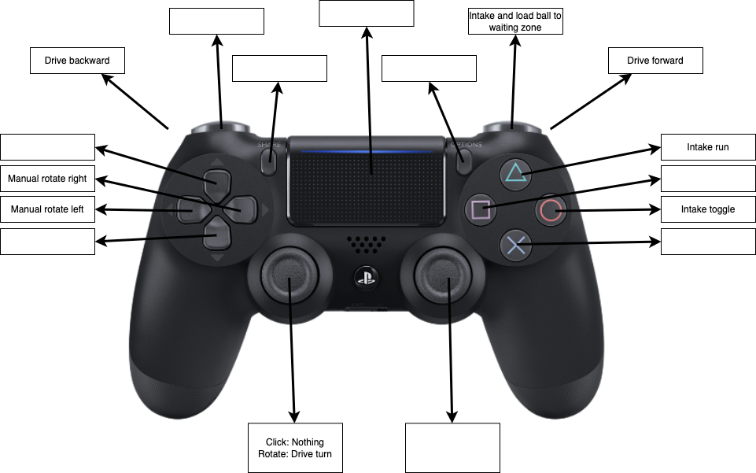
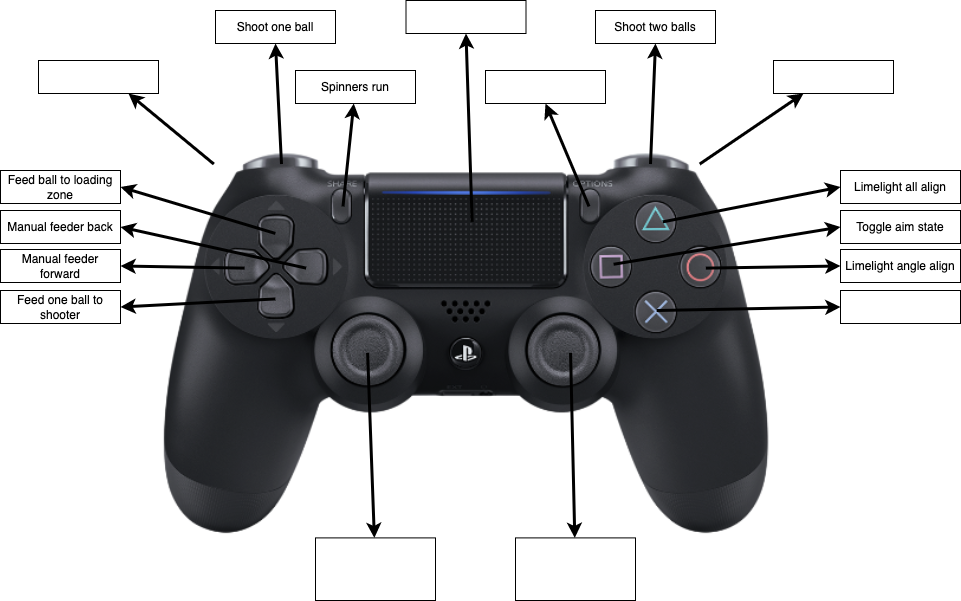
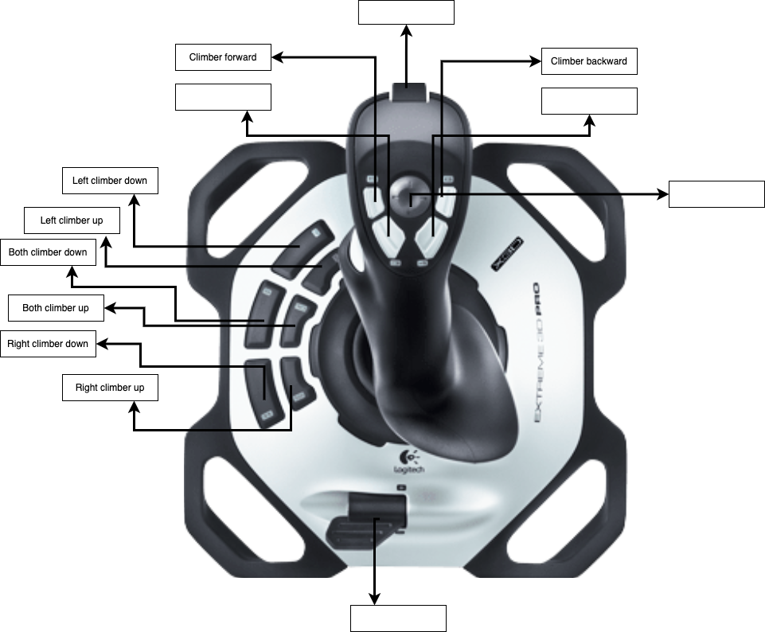

# 3729 Competition Code for FRC 2022 Rapid React

## Getting started
Clone the repository with the command `git clone https://github.com/RegisJesuitRobotics/Competition2022.git`.

## Reformatting code
Run `./gradlew spotlessApply` to reformat code.

## Controls
### Driver controls

### Operator controls

## Autos
A PDF file containing the auto paths can be found in [2022Autos.pdf](./2022Autos.pdf)
